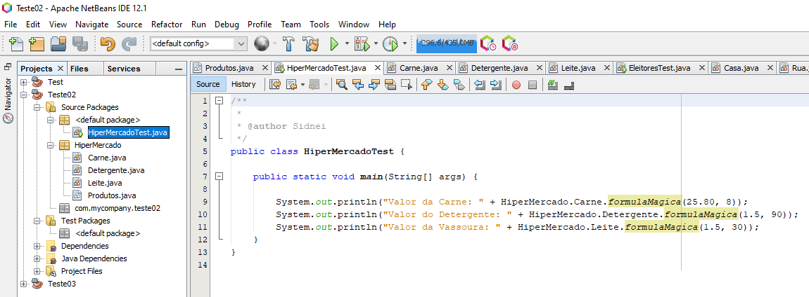
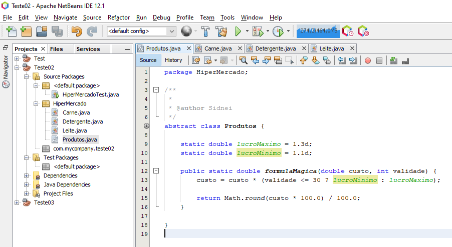
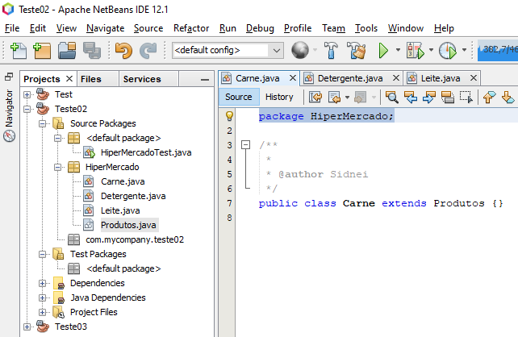
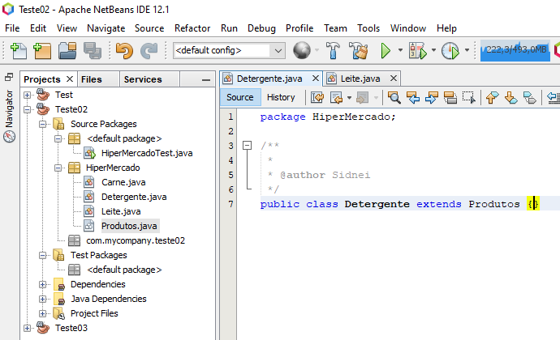
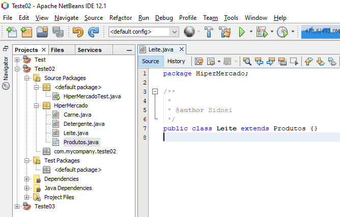

# :books: Direct Talk - Processo Seletivo

## :two: Resposta:

Para este exercício criei um pacote com uma **classe abstrata** que contem o método **formulamagica** e todas as classes filhas herdam suas caracteristicas e métodos.

Calculando os seguintes produtos usando a fórmula Mágica:

<ul>
    <li>Carne: custo R$ 25,80 e validade 8 dias para vencer</li>
    <li>Detergente: custo R$ 1,50 e validade 90 dias para vencer</li>
    <li>Leite: custo R$ 1,50 e validade 30 dias para vencer</li>
</ul>

Para utilizar chamar esse método usamos a sintaxe:    

<strong>NomeDoPacote</strong> . 	<strong>NomeDaClasse</strong> . <strong>MétodoDoTipoStatic</strong>

## HiperMercadoTest.java

  

## Classe Abstrata Produto

Esse classe abstrata, possui um método estático **formulaMagica**, dessa forma todas as classes filhas poderão executar esse método diretamente.

  

## Classe Carne

Essa classe herda as características e métodos de produtos.

  

## Classe Detergente

Essa classe herda as características e métodos de produtos.

  

## Classe Leite

Essa classe herda as características e métodos de produtos.

  

