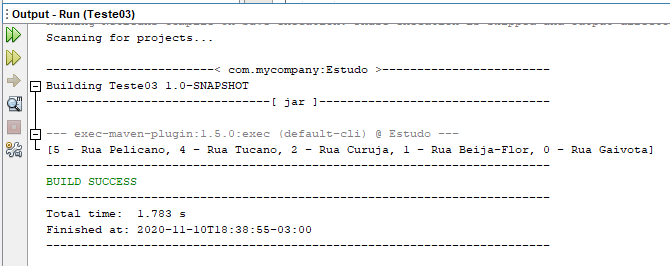
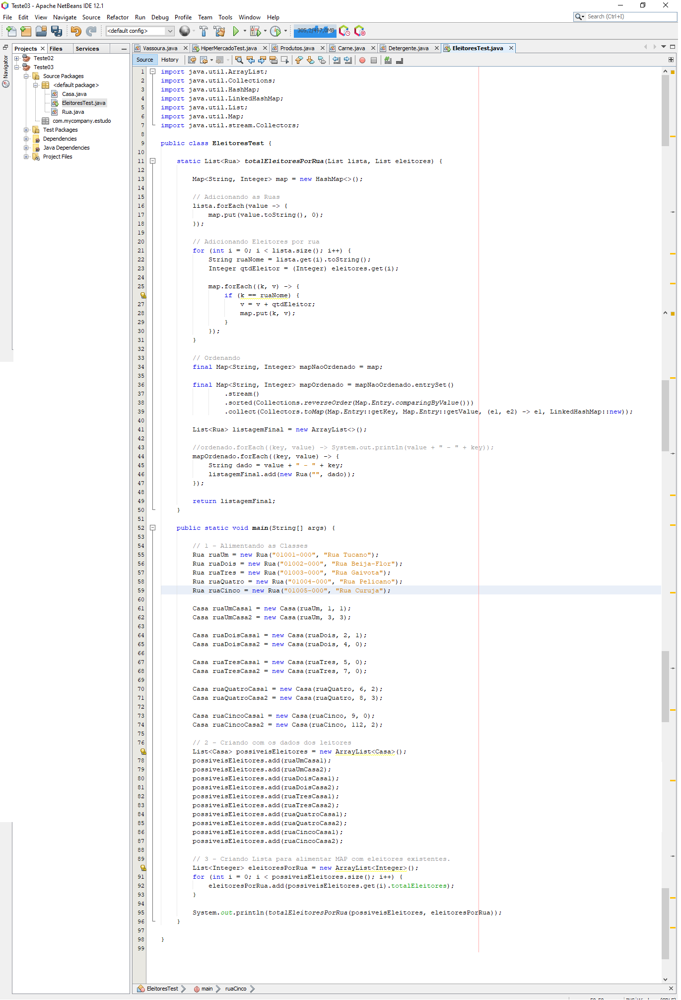
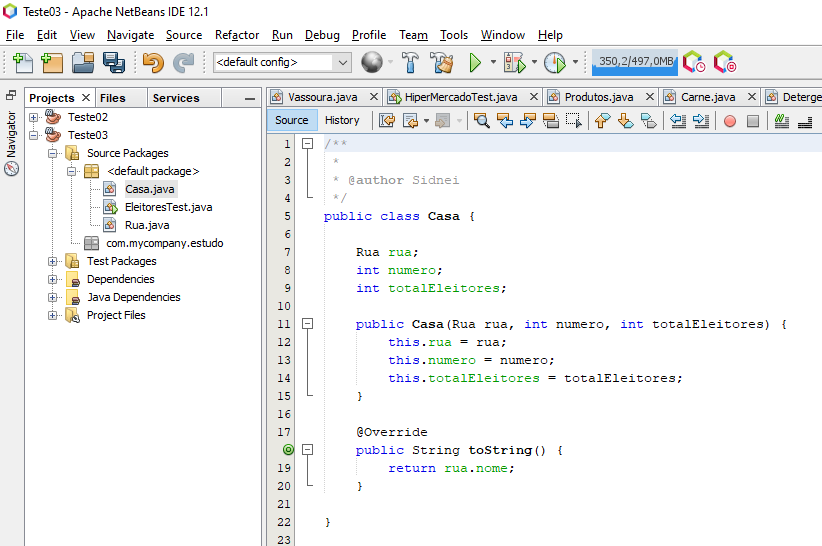
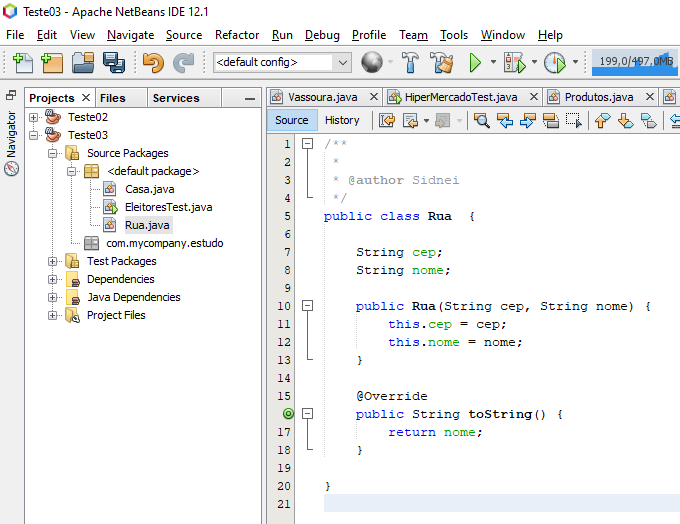

# :books: Direct Talk - Processo Seletivo

## :three: Resposta:

Nesta classe instanciei Rua e Casa, alimentei a class Rua com os nomes de ruas e na class Casa com as instancias de Rua e total de eleitores por casa.

Invoquei o método do tipo static **totalEleitoresPorRua** passando dois parâmetros que são na verdade duas listas :

- possiveisEleitores;
- eleitoresPorRua;

Dentro do método ***totalEleitoresPorRua***, temos 5 etapas:

1. Criar um ***map*** para trabalhar os dados;
2. Adicionar as ruas sem duplicidade no ***map***, com o total de eleitores 0 por rua;
3. Adicionar em cada rua o total geral de eleitores;
4. Ordenar as ruas pelo total de eleitores;
5. Devolver um list com dos dados;

**Resposta apresentado neste exemplo:**

- 5 eleitores no Rua Pelicano
- 4 eleitores na Rua Tucano
- 2 eleitores na Rua Curuja
- 1 eleitor na Rua Beija-Flor
- 0 eleitores na Rua Gaivota

  

## EleitoresTest.java

  

## Classe Casa

  

## Classe Rua

  

