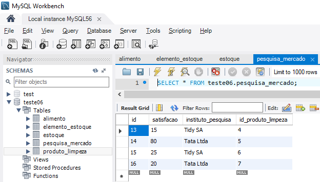

# :books: Direct Talk - Processo Seletivo


## :six: Resposta:

## Tabelas no MySQL.

<div align="left">
  
</div>
<hr>
<div align="left">
  
</div>
<hr>
<div align="left">
  
</div>
<hr>
<div align="left">
  
</div>
<hr>
<div align="left">
  
</div>

## Resultado da Consulta.

<div align="center">
  
</div>

```mysql
(SELECT PL.nome AS 'Produto', DATE_FORMAT(PL.data_validade, '%d-%m-%Y') AS Validade, round(EE.preco * 0.75,2) AS 'Preco', round((EE.preco * 0.75) - EE.custo,2) As 'Lucro'
FROM elemento_estoque AS EE
INNER JOIN produto_limpeza AS PL ON EE.id = PL.id_elemento_estoque
INNER JOIN pesquisa_mercado AS PM ON PL.id = PM.id_produto_limpeza
WHERE PM.satisfacao >= 70)

UNION 

(SELECT A.nome AS 'Produto', DATE_FORMAT(A.data_validade, '%d-%m-%Y') As Validade, round(EE.preco * 0.75,2) AS 'Preco', round((EE.preco * 0.75) - EE.custo,2) As 'Lucro'
FROM elemento_estoque AS EE
INNER JOIN alimento AS A ON EE.id = A.id_elemento_estoque
WHERE A.data_validade <= DATE_ADD(CURDATE(), INTERVAL 5 DAY))

ORDER BY Lucro DESC;
```

