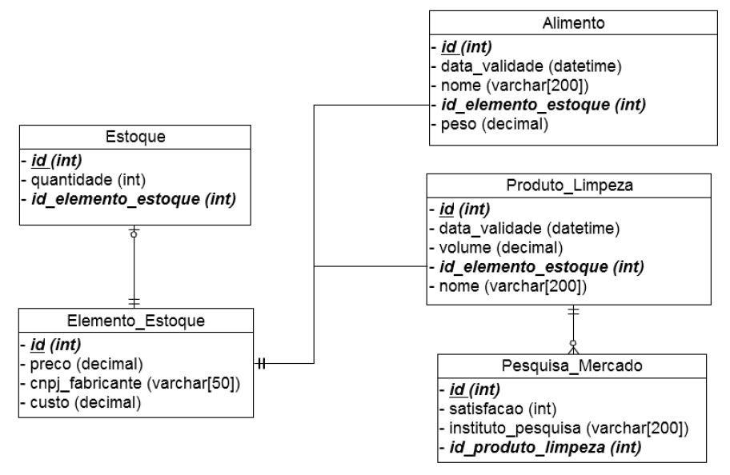

# :books: Direct Talk - Processo Seletivo


## :computer: Vaga para equipe de desenvolvimento


### :one: Em orientação a objetos, é melhor:

**A - Usar uma interface ou uma classe abstrata? Por que? Cite exemplos.**
**B - Usar herança ou delegação a outros objetos? Por que? Cite exemplos.**

<a href="01/README.md" style="font-size: 14px"><strong>VER RESPOSTA</strong></a>

<hr>

### :two: Um hipermercado muito tradicional descobriu uma fórmula mágica para calcular o preço a ser cobrado por um determinado item, fazendo com que o lucro seja maximizado.

A tal fórmula depende basicamente de duas grandezas:

- custo em reais;
- validade em dias.

Os especialistas em TI do hipermercado disponibilizaram uma biblioteca que calcula a
fórmula. Abaixo segue um exemplo de uso:

```java
// variável custo é um double definido previamente
// variável validade é um int definido previamente
double preco = HiperMercado.DT.formulaMagica(custo, validade);
```

No cálculo de custo de um **determinado tipo de item*, podem entrar fatores como custo de aquisição, volume ocupado, necessidade de refrigeração, risco da validade expirar, etc.

Utilizando a função ***formulaMagica*** desenvolva uma solução orientada a objetos que calcule o preço a ser cobrado de um determinado item do estoque.

<a href="02/README.md" style="font-size: 14px"><strong>VER RESPOSTA</strong></a>

<hr>

### :three: Um candidato a prefeito quer saber quais ruas ele deve visitar para impactar o maior número de eleitores. 

### Abaixo seguem objetos já existentes que representam casas e ruas:

```java
class Casa {
    Rua rua ;
	int numero ;
	int totalEleitores;
}

class Rua {
	String cep ;
	String nome ;
}
```

Utilizando obrigatoriamente um ***Map*** em ***Java*** ou um **Dictionary** em ***C#*** implemente um método que receba uma ***List***<Casa> e devolva uma ***List***<Rua> ordenada de maneira decrescente pelo total de eleitores. 

Adicione as classes, os métodos que julgar necessários.

<a href="03/README.md" style="font-size: 14px"><strong>VER RESPOSTA</strong></a>

<hr>

### :four: Esta questão aborda o tratamento de erros orientado a objetos.

**(a) É boa prática definir um tipo específico de exceção que estende da classe Exception? Se sim, em quais casos?**

**(b) Quando você capturaria uma exceção através de clausulas ***try*** e ***catch***? Por que?**

**(c) Em quais situações vocês lançaria uma exceção? Cite exemplos.**


<a href="04/README.md" style="font-size: 14px"><strong>VER RESPOSTA</strong></a>

<hr>

### :five: Considere um web service responsável por crédito e débito em uma conta corrente, que implementa os seguintes métodos:

```java
public void debitar (long idConta, double valor) {
	Conta conta = contaDao.buscaConta(idConta);    
	if (conta.podeDebitar(valor)) {
		conta.debite(valor);
		contaDao.atualiza(conta) ;
    }else{
		throw new SaldoInsuficienteException();
 	}
}

public void creditar (long idConta, double valor) {
	Conta conta = contaDao.buscaConta(idConta);
	conta.credite(valor);
	contaDao.atualiza(conta);
}
```

**Analise a solução, considerando concorrência entre chamadas e escopo de transações.**

<a href="05/README.md" style="font-size: 14px"><strong>VER RESPOSTA</strong></a>

<hr>

### :six: Uma rede de supermercados que vende alimentos e produtos de limpeza teve acesso a pesquisas de mercado, feitas por diversos institutos de pesquisa, a pedido dos fabricantes.

Os dados foram modelados em um banco de dados, conforme mostra a figura 1.

Um gerente de um dos supermercados teve a ideia de elaborar kits que contenham um produto de limpeza bem avaliado e um alimento cujo prazo de validade esteja perto de vencer, para minimizar prejuízos.

Ele considerou que um **produto de limpeza é bem avaliado se o valor médio de satisfação nas pesquisas de mercado for superior a 70%** e que um **alimento está perto do vencimento se faltar menos de 5 dias para vencer.** 

Para tornar o kit mais atrativo, ele resolveu dar um **desconto de 15% na soma do preço dos produtos**.

Faça uma consulta SQL que devolve linhas que representam possíveis kits **ordenados pelo lucro**, isto é, preço do item menos o custo.

**Esta consulta deve devolver:**

- [x] nome do produto de limpeza;
- [x] nome do alimento;
- [x] preço do kit ;
- [x] lucro do kit ;
- [x] data de validade do kit.

<div align="center">
  
</div>


Figura 1: Diagrama E-R do supermercado. Chaves primárias em negrito e sublinhadas e chaves estrangeiras apenas em negrito. 

Observação: pesquisa de satisfação é um inteiro entre 0 e 100.

<a href="06/README.md" style="font-size: 14px"><strong>VER RESPOSTA</strong></a>

<hr>
<p style="color:gray; font-size> 10px">Direct Talk - Todos os direitos reservados.</p>